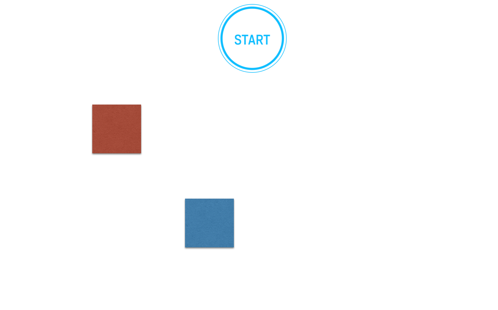
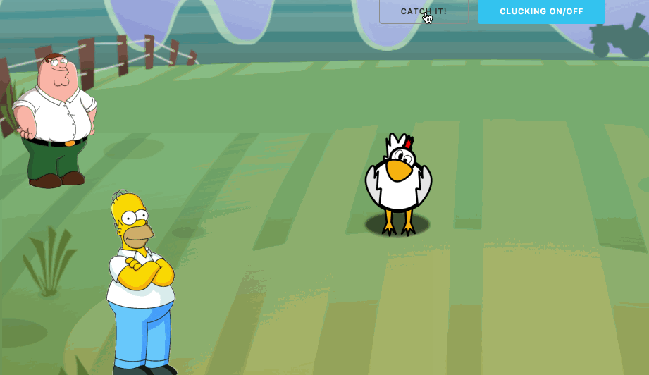
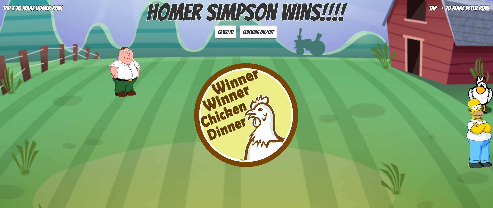

# JavaScript Racer

## Introduction

We are going to create a "racer game" using JavaScript, HTML, and CSS. This will be your first "formal" challenge to assess your knowledge of programming fundamentals and HTML/CSS.

You will work individually on this assignment, but we will guide you as you get started.


## Exercise

#### Requirements

- You should use separation of logic. In other words, include separate HTML, CSS, and JavaScript files.
- Your game should not start right away- have a "Start" menu. Find a nice image for your "Start" menu. When you click "Start", the start menu should disappear, and the game should begin.

  For example, in this landing page, when you click on the "Explore" button, the start menu would become hidden:


- Build out your game page; your game should only start on the click of a button. The button can say anything you would like; for example, "START" or "CATCH IT." Here is an example of a racing game:




Here is a more complicated example:



- Style your landing page and game page with class-based CSS. For example:

```css
.btn-start {
  background: #18BC9C;
  border-color: #18BC9C;
}

```

- Comment your code appropriately. For example:

```js
// this moves the red square
redPosition += 10;

```

#### Starter code

Use the start code folder. Here are some tips on how to get started:

- Start simple! Ask yourself what the MVP of this project is.
- Create CSS styles that create one red square div and one blue, lined up on the left side of the screen.
```
background-color: red;
```
- In your JS, create some variables to keep track of the position of your two squares
```
var redPosition = 0;
var bluePosition = 0;
```
- Add a keyup event listener that console logs "blue move" or "red move."
```
document.addEventListener("keydown", function(event) {
    console.log("keydown: " + event.keyCode);
});
```
- Replace that console log with JavaScript that moves the red or blue div a little to the right.
```
redPosition += 5;
document.getElementById('#red-square').style.left = redPosition + "px";
```
- Use a background image instead of just background-color for your players.
- Run with it from there!
- If you are stuck on a problem, use pseudocode to break it down into smaller, more solvable problems.
- If you need some ideas on where to start, watch this [video](https://www.youtube.com/watch?v=QVSwX98kKFs).

**Bonus:**

- Can you create all the `<div class="box"></div>` elements in JS instead of HTML?
- Use images to create a background and/or players.
- Display the time it took for the player to complete the race. See [Date.now()](https://developer.mozilla.org/en-US/docs/Web/JavaScript/Reference/Global_Objects/Date/now)
- Score each game based on the time it took to complete, and by how much time the player beat the opposition.
- Make a 'Best of 3' tournament and display the winner of the tournament.
- Keep track of best times/high scores across page refreshes using `[localStorage](http://stackoverflow.com/a/28615560)`.
- Add animations.
- Have players do something other than simply pressing a key to move their player; for example, make them type words, or solve simple math problems.
- Upon the click of a button, allow your players to turn a sound on or off.


#### Deliverable

You should turn in your HTML, CSS, and JavaScript files to a GitHub repository (fork).

Here's a screenshot of what your game page could look like:



## Additional Resources
- JavaScript [Documentation](https://developer.mozilla.org/en-US/docs/Web/JavaScript).
- An [excellent resource](https://developer.mozilla.org/en-US/docs/Web/Events) for working with the DOM in Vanilla JavaScript.
- [Should you learn DOM manipulation in JavaScript before jQuery?](https://www.reddit.com/r/javascript/comments/3hpm1v/should_i_learn_dom_manipulation_with_raw/)
